# Irgo3学术搜索引擎——中文简介

## 1.概况
- 项目主要分为5个模块,客户端（vue前端）、服务端（flask后端）、搜索引擎（ElasticSearch)、数据库（MongoDB)、爬虫
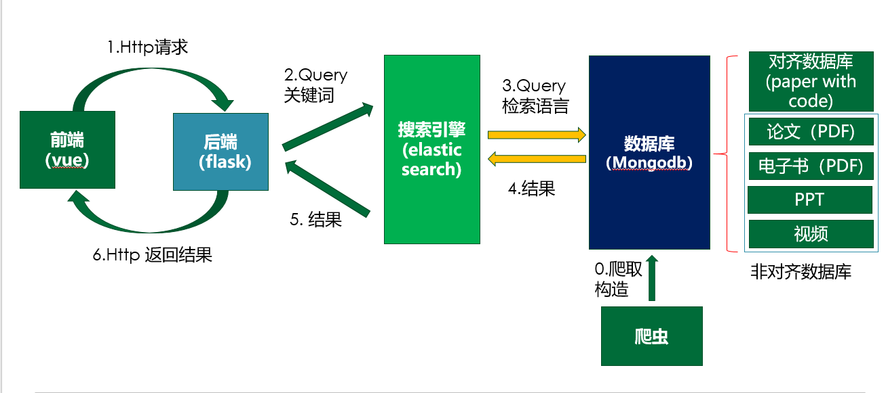

- 项目中有两个客户端,`engine_front`更加完整一些,`front_end`功能上也是完整的，特效略显不足;

- 详情请见`report.ppt`

## 2.项目配置

### 2.1 配置版本

本项目在windows上运行，其中相关服务的版本号
* Nodejs：v16.14.0
* Python、Flask：参见backend文件夹下的requirements
* MongoDB：db version v5.0.10-rc0
* monstache：6.7.11
* ElasticSearch：7.5.0

其它辅助工具:
* navicat：navicat 15，用于方便地查看数据库的数据;（需要进行破解）
* kiabana：kiabana 7.5.0，用于方便地查看ElasticSearch的数据；

注: 不同版本的服务合并在一起可能出现问题，例如使用比较新的ElasticSearch执行初始化操作，可能会发生如下错误：
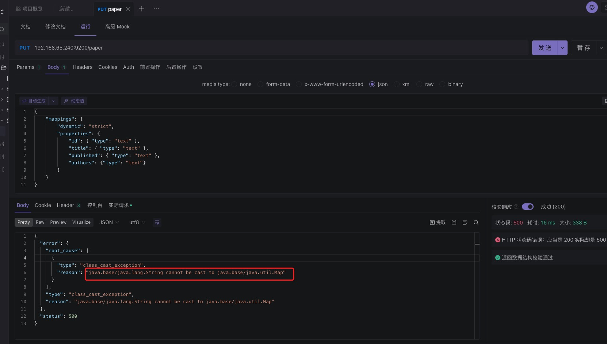

### 2.2 数据获取
获取过程与预处理略。
* 启动爬虫爬取数据，爬取后的数据中有一部分URL需要加上网站的前缀；
* 从paperwithcode和ACL等不同来源爬取的数据需要将字段整理一致。
* ACL_crawler不能直接使用,需要修改;

已获取的测试数据可以从百度网盘下载：

```
链接：https://pan.baidu.com/s/1uKJsWsMOUDAlzRoKsws1aw 
提取码：14nw 
```

#### 示例
以下是整理好的四个数据库的展示，注意副本集和主集合的内容应该是一样的：

- 电子书ebook:
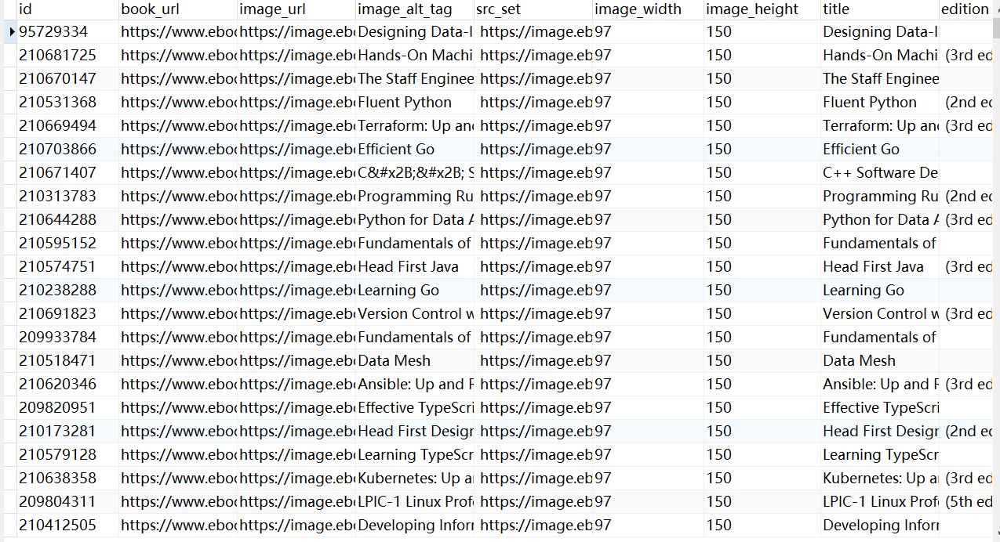
- 论文paper:
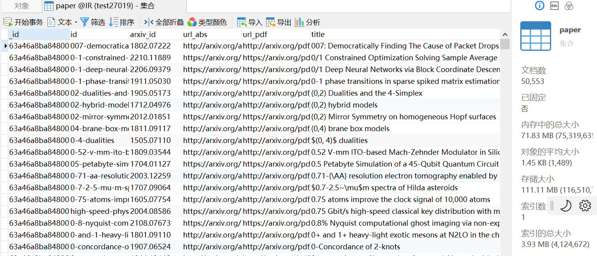
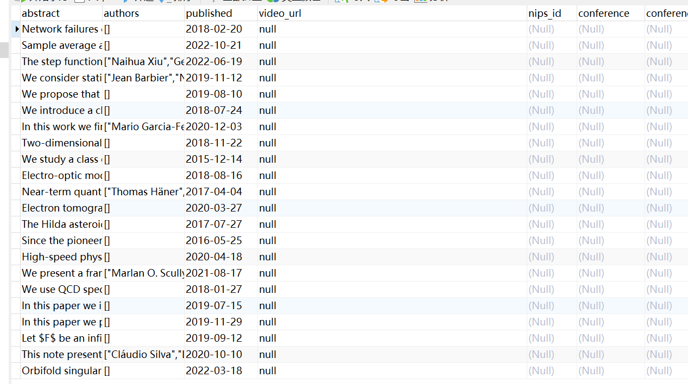
- 演示文稿PPT:

- 视频videos:
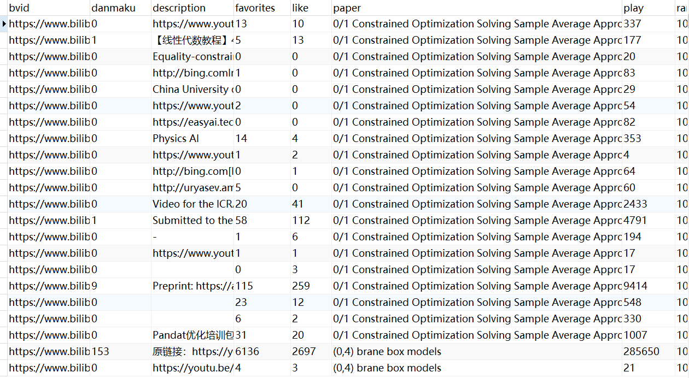
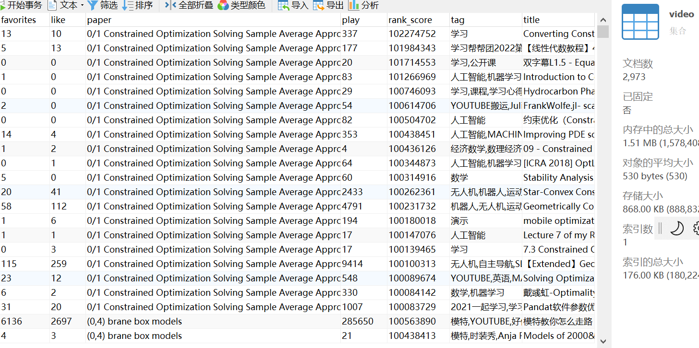

配置好的视图配置展示：

- 电子书ebook:
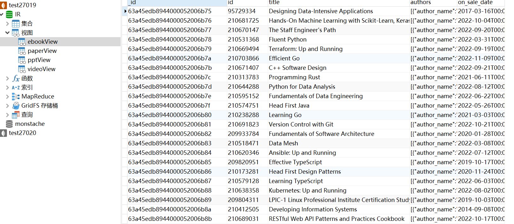
- 论文paper:
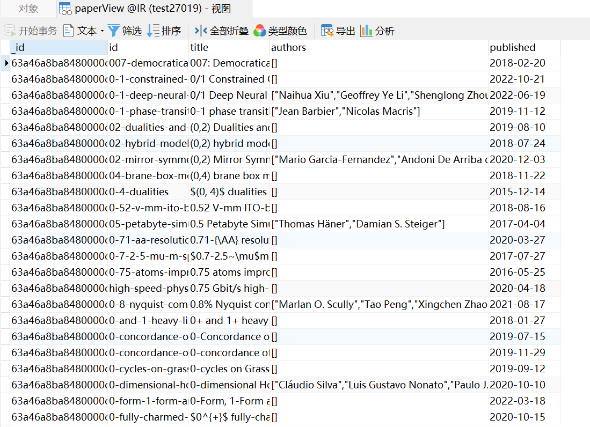

- 演示文稿PPT:
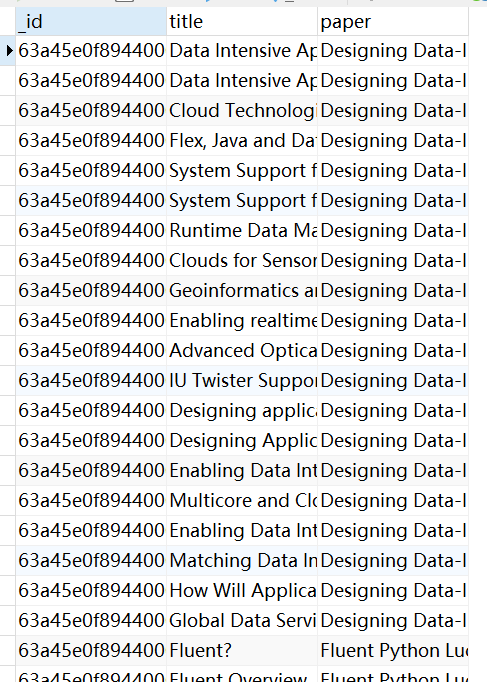
- 视频videos:
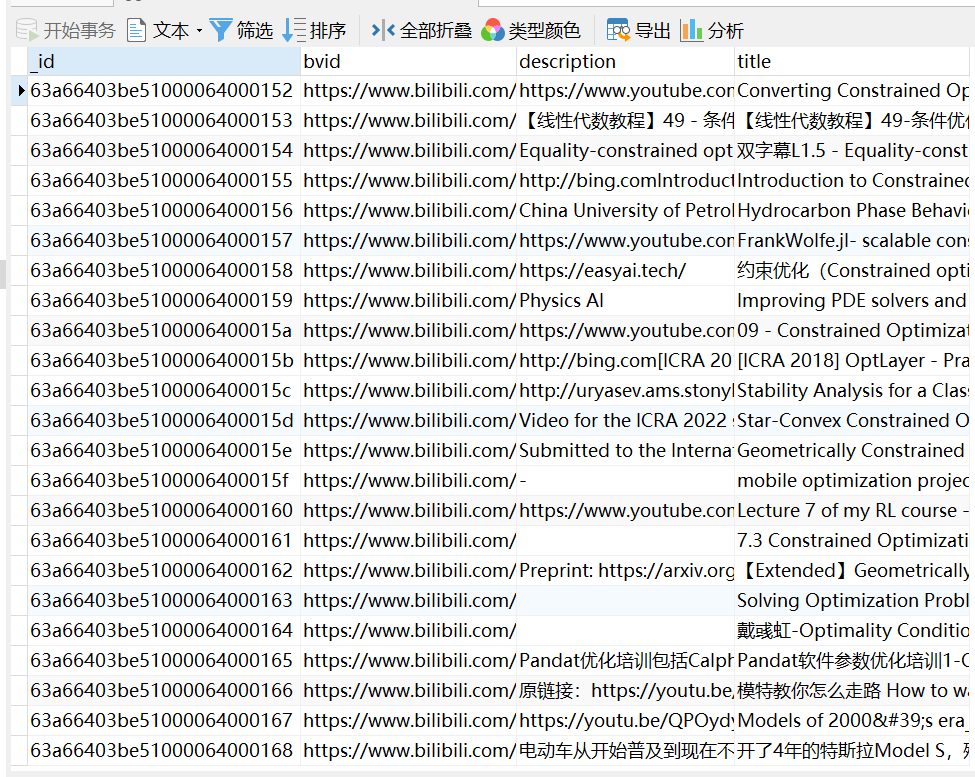

同步成功的ElasticSearch索引信息如下所示：

- 索引信息:
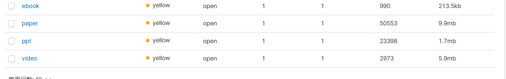

- 查询测试:
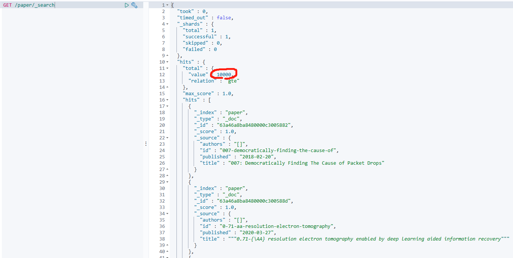

- 索引映射信息：
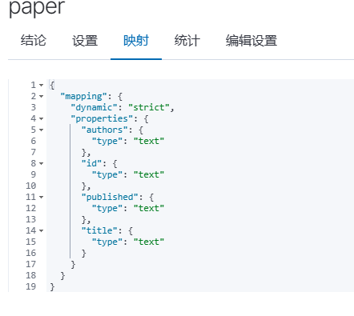

* 注意：如果monstache同步失败,不会报错,但是ES中是没有数据的

### 2.3 配置过程

1. 数据库、ES配置：
* 将爬虫爬取得到的json数据，导入到数据库(mongoDB)中；
* 需要将Mongodb的数据同步到ElasticSearch中；
* 详见config文件夹的readme;

2. 服务端python依赖配置:

在conda环境启动以后,进入`backend`文件夹,其中`requirements.txt`在该文件夹中;
```python
conda create -n minisearch python=3.7
pip install -r requirements.txt
```

也可以如下一点点安装;
```python
conda create -n minisearch python=3.7
conda install flask==2.0.2
conda install flask_cors==3.0.8
conda install elasticsearch==7.0.4
conda install pymongo==3.12.0
```

3. 客户端配置:
- 首先安装nodejs,使得能用npm;
- 进入项目文件夹`engine_front`,运行`npm install`,安装项目依赖;

## 3.运行步骤 

1. 启动数据库，详见config文件夹的readme
2. 启动Elasticsearch，详见config文件夹的readme（同步后数据查询实际发生于Elasticsearch）
3. 启动monstache，将数据库与ElasitcSearch同步，详见config文件夹的readme（有数据同步需求时操作即可,没有则不必操作）

4. 启动服务器:
- 启动conda虚拟环境，运行:conda activate minisearch
- 进入server目录`backend`,运行:python main.py

5. 启动客户端:
- 进入client目录`engine_front`，运行：npm run serve

# Irgo3 scientific search engine —— English version

## Introduction
Our project contains mainly 5 parts,that is webcrawle,a front end,a backend,a mongodb database and an Elasticsearch search engine part.
1. we have to admit that the webcrawler is not very powerful but merely for collect data process.
2. The project now is merely a demo projects.
 
Please refer to the `report.PPT` for details

## Configuration in windows
For details please refer to the `readme` in `config` file folder

## Runing process
1. start the two replica of the database:please refer to the `readme` in `config` folder
2. start Elasticsearch:please refer to the `readme` in `config` folder
3. start the server:

- first install the dependencies of the server part,do the following instructions:

```python
conda create -n minisearch python=3.7
conda install flask==2.0.2
conda install flask_cors==3.0.8
conda install elasticsearch==7.0.4
conda install pymongo==3.12.0
```
or you can follow the `requirements.txt` file using the following command:
```python
conda create -n minisearch python=3.7
pip install -r requirements.txt
```
* notice the flask package installation probably have some problem; 
* the total dependent package are listed below,if some packages conflict, please check the version again.Notice the package includes scrapyelasticsearch and scrapy which is for the webcrawler and not used here.

```shell
attrs                     22.1.0                   pypi_0    pypi
automat                   22.10.0                  pypi_0    pypi
ca-certificates           2022.10.11           haa95532_0
certifi                   2022.12.7        py37haa95532_0
cffi                      1.15.1                   pypi_0    pypi
click                     8.1.3                    pypi_0    pypi
colorama                  0.4.6                    pypi_0    pypi
constantly                15.1.0                   pypi_0    pypi
cryptography              38.0.4                   pypi_0    pypi
cssselect                 1.2.0                    pypi_0    pypi
elasticsearch             7.0.4                    pypi_0    pypi
flask                     2.0.2                    pypi_0    pypi
flask-cors                3.0.8                    pypi_0    pypi
hyperlink                 21.0.0                   pypi_0    pypi
idna                      3.4                      pypi_0    pypi
importlib-metadata        5.1.0                    pypi_0    pypi
incremental               22.10.0                  pypi_0    pypi
itsdangerous              2.1.2                    pypi_0    pypi
jinja2                    3.0.3                    pypi_0    pypi
lxml                      4.9.1                    pypi_0    pypi
markupsafe                2.1.1                    pypi_0    pypi
openssl                   1.1.1s               h2bbff1b_0
packaging                 21.3                     pypi_0    pypi
parsel                    1.7.0                    pypi_0    pypi
pip                       22.2.2           py37haa95532_0
pyasn1                    0.4.8                    pypi_0    pypi
pyasn1-modules            0.2.8                    pypi_0    pypi
pycparser                 2.21                     pypi_0    pypi
pydispatcher              2.0.6                    pypi_0    pypi
pyhamcrest                2.0.4                    pypi_0    pypi
pymongo                   3.12.0           py37hd77b12b_0
pyopenssl                 22.0.0                   pypi_0    pypi
pyparsing                 3.0.9                    pypi_0    pypi
python                    3.7.15               h6244533_1
queuelib                  1.6.2                    pypi_0    pypi
scrapy                    1.6.0                    pypi_0    pypi
scrapyelasticsearch       0.9.1                    pypi_0    pypi
service-identity          21.1.0                   pypi_0    pypi
setuptools                65.5.0           py37haa95532_0
six                       1.16.0                   pypi_0    pypi
sqlite                    3.40.0               h2bbff1b_0
twisted                   20.3.0                   pypi_0    pypi
twisted-iocpsupport       1.0.2                    pypi_0    pypi
typing-extensions         4.4.0                    pypi_0    pypi
urllib3                   1.26.13                  pypi_0    pypi
vc                        14.2                 h21ff451_1
vs2015_runtime            14.27.29016          h5e58377_2
w3lib                     2.1.0                    pypi_0    pypi
werkzeug                  2.2.2                    pypi_0    pypi
wheel                     0.37.1             pyhd3eb1b0_0
wincertstore              0.2              py37haa95532_2
zipp                      3.11.0                   pypi_0    pypi
zope-interface            5.5.2                    pypi_0    pypi
```
- in the conda prompt ,do `activate minisearch`
- run `cd backend` to switch to  the `backend` folder, and just run `python main.py`

4. start the client(frontend):
- first make sure you have installed the nodejs, and able to use `npm`;
- run `npm install` to install the dependencies;  
- run `cd engine_front` to switch to  the `engine_front` folder, and just run `npm run serve`

