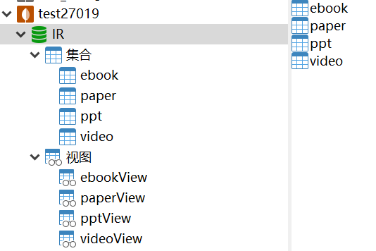
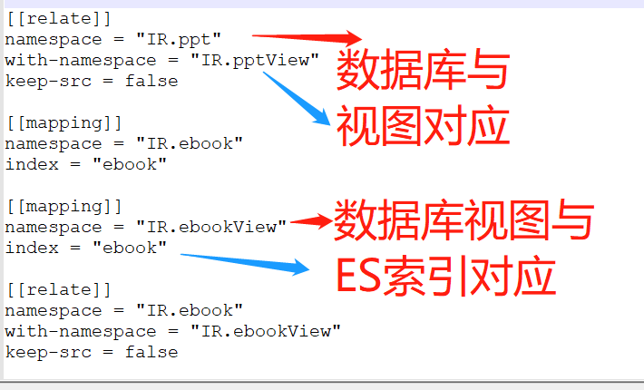
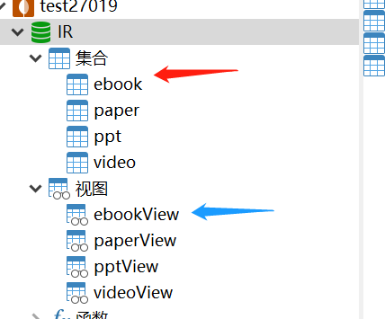
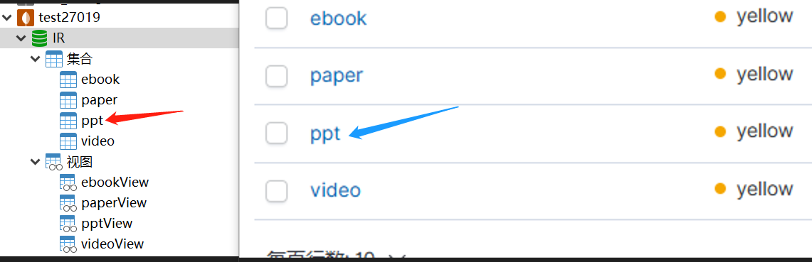

## 环境配置说明

### 1. 创建并开启mongoDB副本集
参考:
https://www.pudn.com/news/6305f30476296c16d32cd777.html

* 其中数据库可以不用放在原本下载的mongoDB文件夹中,但是相应的master.conf与slaver.conf需要修改正确；
* 需要把文件夹和log文件事先记录好;
可参见本项目config中的`slaver.conf`和`master.conf`


### 2. 将paper、video、ppt、ebook的爬虫数据保存至数据库IR下
当然首先需要创建MongoDB的数据库IR，命令略；

其中的测试数据对应关系如下：
* paper.json：论文数据;
* video_part、paper_bilibili.json：视频数据;
* slideserve_new：PPT数据;
* ebook_new.json：电子书数据;

保存后的数据如下所示:


### 3. 创建视图，对应./config/createView.txt文件

```
# mongo
rs0:PRIMARY> use IR
rs0:PRIMARY> db.createView("paperView", "paper", [{$project: {"id": 1, "title": 1, "published": 1, "authors": 1}}])
rs0:PRIMARY>db.createView("videoView", "video", [{$project: {"bvid": 1, "title": 1, "description": 1}}])
rs0:PRIMARY>db.createView("pptView", "ppt", [{$project: {"title": 1, "paper": 1}}])
rs0:PRIMARY>db.createView("ebookView", "ebook", [{$project: {"id": 1, "title": 1, "authors": 1, "on_sale_date": 1}}])
```

### 4. 创建es索引，对应./config/...sh文件

删除原有索引，并创建新索引

```
bash build_paper.sh
bash build_video.sh
bash build_ppt.sh
bash build_ebook.sh
```

### 5. 安装monstache并配置相关文件，对应./config/config.toml
* monstache安装:
https://rwynn.github.io/monstache-site/start/#installation

将配置文件`config.toml`放于相应路径中，例如使用windows则需要放在monstache的`./build/monstache-9e60b1d/build/windows-amd64`路径下,例如放置在`D:\monstache-6cdd72c\build\windows-amd64`下；

配置文件`config.toml`的书写：
* 注意应当将mongoDB、elasticsearch等等的url写对
* 文件logger路径以及下面的mongoDB视图(namespace)、Elasticsearch的index应该匹配，否则会同步失败；

例如：




### 6. 执行monstache，实现mongodb与elasticSearch数据同步
进入相应的monstache目录，例如我们是在windows机器上操作，那么进入文件夹`\monstache-6cdd72c\build\windows-amd64`,比如我是进入:`D:\monstache-6cdd72c\build\windows-amd64`

执行：
```
monstache -f config.toml
```

